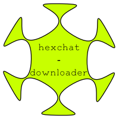

# XDCC Downloader

|master|develop|
|:---:|:---:|
|[](https://gitlab.namibsun.net/namibsun/python/xdcc-dl/commits/master)|[](https://gitlab.namibsun.net/namibsun/python/xdcc-dl/commits/develop)|



An XDCC File downloader based on the [irclib](https://github.com/jaraco/irc) framework.

## Installation

Either install the program using `pip install xdcc-dl` or `python setup.py install`

Please not that python 2 is no longer supported, the project requires python 3 to run.

## Usage

### Message-based CLI

XDCC Packlists usually list xdcc commands in the following form:

    /msg <BOTNAME> xdcc send #<PACKNUMBER>
    
By supplying this message as a positional parameter, the pack can be downloaded.

**Examples:**

    # This is the xdcc message:  '/msg the_bot xdcc send #1'
    
    # This command downloads pack 1 from the_bot
    $ xdcc-dl "/msg the_bot xdcc send #1"
    
    # It's possible to download a range of packs (1-10 in this case):
    $ xdcc-dl "/msg the_bot xdcc send #1-10"
    
    # Range stepping is also possible:
    $ xdcc-dl "/msg the_bot xdcc send #1-10;2"
    # (This will download packs 1,3,5,7,9)

    # Explicitly specifying the packs to download as a comma-separated list:
    $ xdcc-dl "/msg the_bot xdcc send #1,2,5,8"
    # (This will download packs 1,2,5,8)
    
    # you can also specify the destination file or directory:
    $ xdcc-dl "/msg the_bot xdcc send #1" -o /home/user/Downloads/test.txt
    
    # if the bot is on a different server than irc.rizon.net, a server
    # has to be specified:
    $ xdcc-dl "/msg the_bot xdcc send #1" --server irc.freenode.org
    
    # To specify different levels of verbosity, pass the `--verbose` or
    # `--quiet` flag
    $ xdcc-dl -v ...
    $ xdcc-dl -q ...

### As a library:

xdcc-dl is built to be used as a library for use in other projects.
To make use of the XDCC downloader in your application, you will first need to
create a list of [XDCCPack](xdcc_dl/entitites/XDCCPack.py) objects.

This can be done manually using the constructor, the XDCCPack.from_xdcc_message
class method or by using an
[XDCC Search Engine](xdcc_dl/pack_search/SearchEngine.py)

Once this list of XDCCPacks is created, use the `download_packs` function in
the `xdcc module`.

An example on how to use the library is listed below:

```python

from xdcc_dl.xdcc import download_packs
from xdcc_dl.pack_search import SearchEngines
from xdcc_dl.entities import XDCCPack, IrcServer

# Generate packs
manual = XDCCPack(IrcServer("irc.rizon.net"), "bot", 1)
from_message = XDCCPack.from_xdcc_message("/msg bot xdcc send #2-10")
search_results = SearchEngines.HORRIBLESUBS.value.search("Test")
combined = [manual] + from_message + search_results

# Start download
download_packs(combined)

```


    
## Projects using xdcc-dl

* [toktokkie](https://gitlab.namibsun.net/namibsun/python/toktokkie)
   
## Further Information

* [Changelog](CHANGELOG)
* [License (GPLv3)](LICENSE)
* [Gitlab](https://gitlab.namibsun.net/namibsun/python/xdcc-dl)
* [Github](https://github.com/namboy94/xdcc-dl)
* [Progstats](https://progstats.namibsun.net/projects/xdcc-dl)
* [PyPi](https://pypi.org/project/xdcc-dl)
